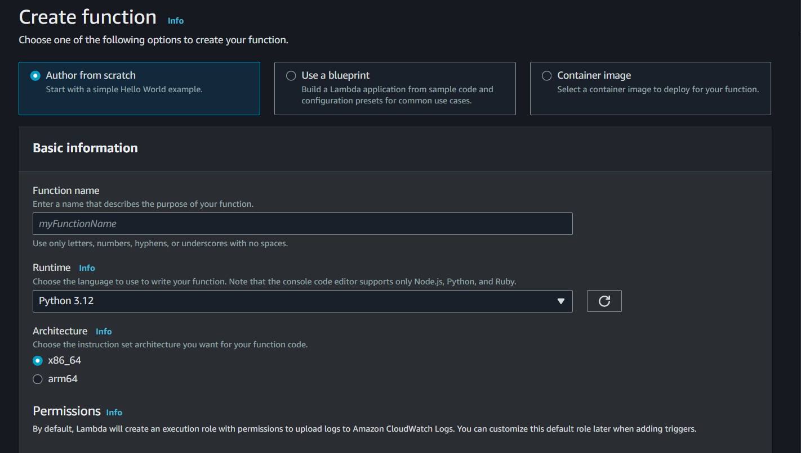
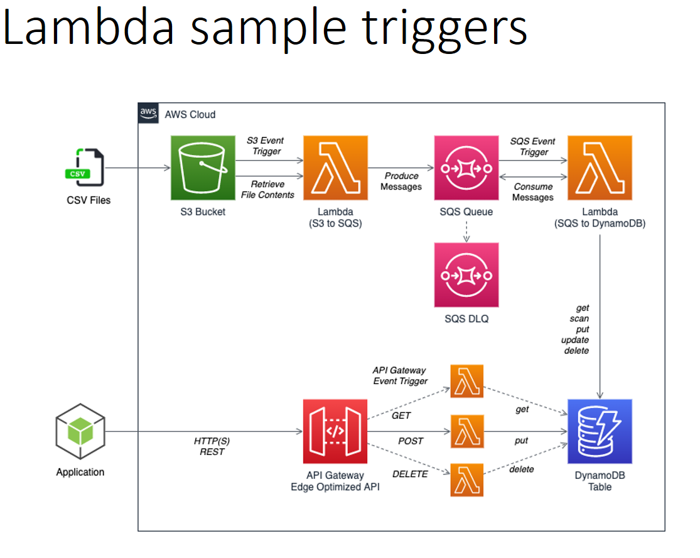
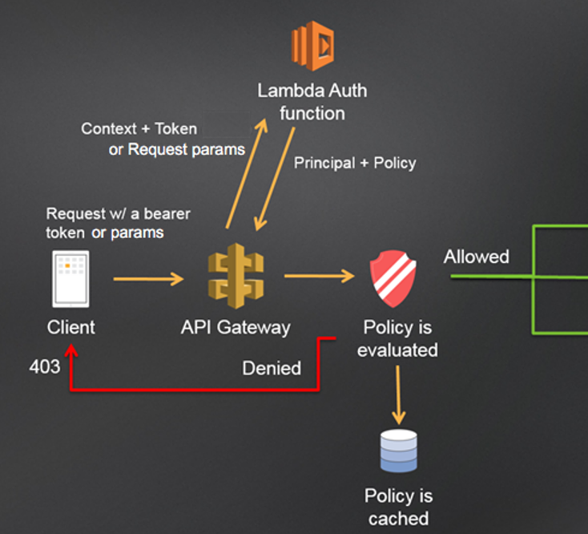
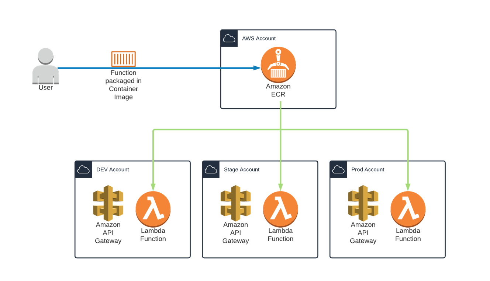
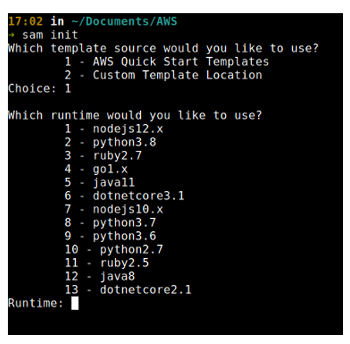
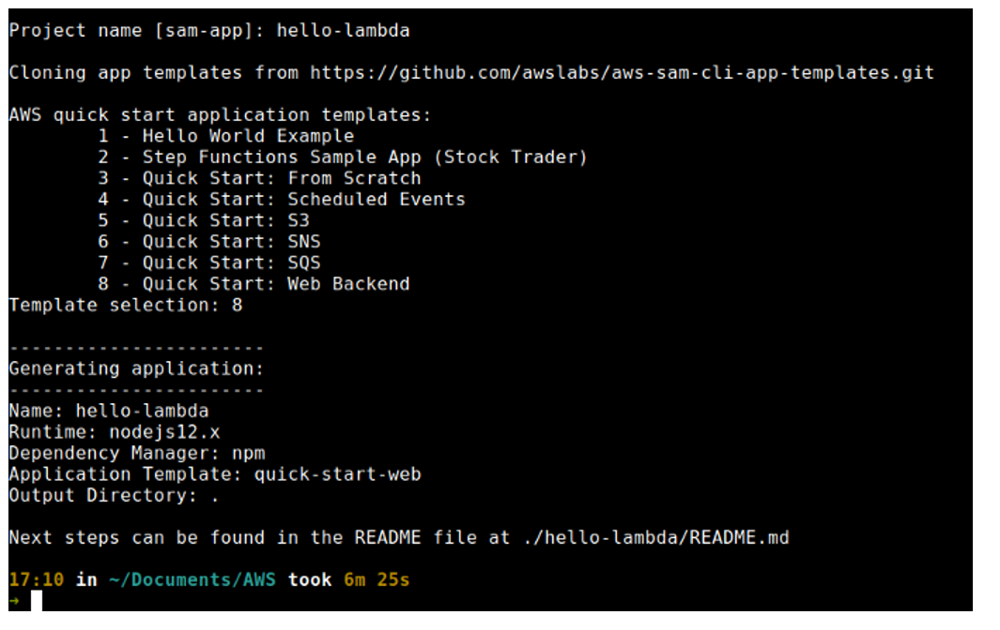
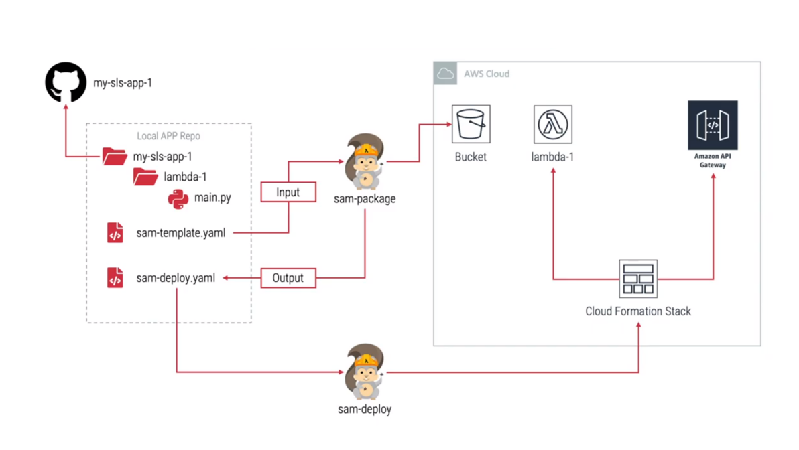
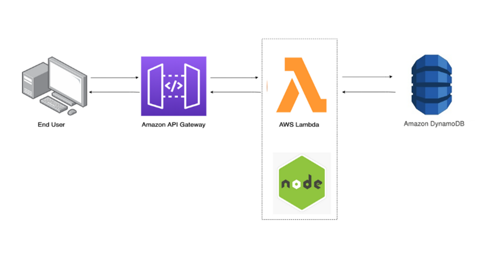
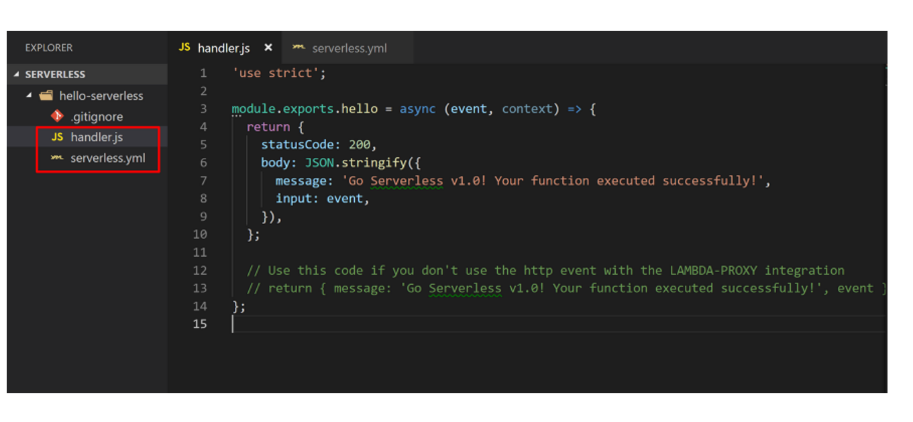
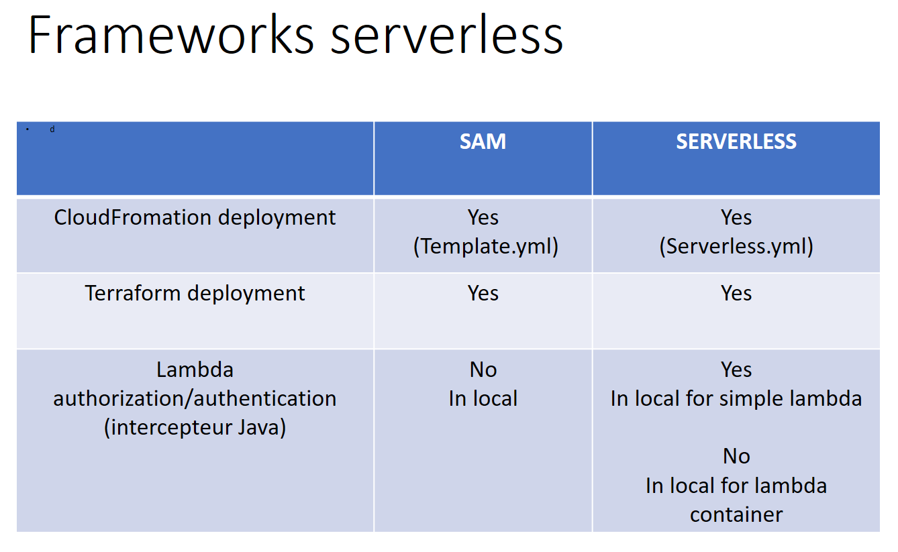

# AWS Lambda: choose your playground offline in local machine !

## Overview

We are diving into the world of AWS Lambda and exploring tools that empower us to develop and test our serverless code locally. By harnessing these tools, we ensure our applications run seamlessly in the cloud environment. Let's embark on a journey to discover the primary options available, enabling us to streamline our development process and verify the functionality of our Lambda functions with confidence

## Table of Contents

- [Prerequistes](#prerequistes)
- [Resources links](#resources)
- [Reminder](#reminder)
  - [Basic Lambda](#basic-lambda)
  - [Authorizer Lambda](#authorizer-lambda)
  - [Container Lambda](#container-lambda)
- [Lambda frameworks in local](#lambda-frameworks-in-local)
    - [SAM](#sam-framework)
    - [Serverless framework](#serverless-framework)
- [Comparisons](#comparisons)
- [Reference](#reference)


## Prerequistes

Before we delve into the world of AWS Lambda development, it's essential to set up the necessary tools to streamline our workflow. These tools are crucial for local development and testing, ensuring a smooth transition to the cloud environment. Let's take a moment to install these prerequisites if you haven't already, paving the way for a seamless Lambda development experience.

`Nodejs via Nvm (gestion des versions) … ou Python`  
`AWS CLI`   
`AWS SAM CLI`     
`Serverless Framework (alternative)`        
`Docker`

## Resources

In case you're uncertain about where to find them, here are the official links:

- [AWS CLI (for deploying)](https://docs.aws.amazon.com/cli/latest/userguide/install-cliv2-windows.html)
- [SAM CLI](https://docs.aws.amazon.com/cli/latest/userguide/install-cliv2-windows.html)
- [Serverless framework](https://www.serverless.com/framework/docs/getting-started/)


## Reminder

Let's take a moment to refresh what we are dealing with. We're focusing on three distinct types of Lambda functions:

**_Basic Lambda_**: These are your standard serverless functions, handling specific tasks or processes.

**_Authorizer Lambda_**: Responsible for authentication and authorization tasks, ensuring secure access to resources.

**_Container Lambda_**: Offering the flexibility of running custom Docker containers as Lambda functions, ideal for complex workloads or specialized environments.

To create a Lambda function manually, follow these steps:

1. Go to the AWS Management Console.
2. In the search bar, type "Lambda" and select Lambda from the options.
3. Click on the "Create function" button to begin creating your Lambda function.




### Basic Lambda

There are many ways a lambda can be triggered.
Let's illustrate it
Lambda functions can be triggered by file uploads to S3, HTTP requests via API Gateway, database changes in DynamoDB, scheduled events with CloudWatch, message publishes through SNS, and message queues in SQS etc.



### Authorizer Lambda

The Authorizer Lambda assists in authentication and authorization, ensuring that only authorized requests are allowed to proceed.



### Container Lambda

Container Lambda integrates with Amazon Elastic Container Registry (ECR), allowing you to store, manage, and deploy your Docker container images seamlessly within the AWS ecosystem for enhanced flexibility and scalability



## Lambda frameworks in local

Let's explore the two primary frameworks for launching and testing Lambda functions locally: AWS SAM (Serverless Application Model) and Serverless Framework.

### SAM framework
if SAM is installed on your machine.
You are going to be guided for creating a lambda.

```bash
sam init
``` 






Use the sam local invoke command to invoke your Lambda function locally and test it:

```bash
sam local invoke <function_logical_id> -e <event_file.json>
```  
Replace <function_logical_id> with the logical ID of your Lambda function in the template.yaml file. Optionally, you can provide an event JSON file using the -e flag to simulate different event triggers

#### SAM structure details

The main file here is SAM Template, this how it is structured

**GetS3BucketsFunction**
- FunctionName: The name of the lambda function to be created
- Description: A short description of your lambda function
- Role: AWS IAM role that has access to the S3 buckets
- CodeUri: The name of the directory for your lambda function
- Handler: The entry point to the lambda function. It follows the “fileName.methodName” naming convention

**GetS3BucketsAPI**
- Name: Name of the API event that will trigger this lambda function
- Path: The route URL of the API

**_After local test you can deploy it, here an illustration_**.




### Serverless framework
We'll start by assuming you have Node.js already installed on your machine, which is required for using the Serverless Framework.

Next, install the Serverless Framework globally by running:

```bash
npm install -g serverless
``` 

To create a new serverless project, use the following command:

```lua
  serverless create --template aws-nodejs
``` 
Of course you can use another template techno for your need

Then, install the serverless-offline plugin as a development dependency:

```lua
  npm install serverless-offline --save-dev
```

Make sure to include the plugin in your serverless.yml file:
```yaml
  plugins:
    - serverless-offline
```

Finally, start the local environment by running:
```lua
  serverless offline
```
This will launch a local environment emulating AWS Lambda and API Gateway, allowing you to test your serverless functions locally.

_Basically this is what we try to simulate:_



_A sneak peek on the two main files for running in local_:



## Comparisons

Broadly speaking:

| Aspect            | AWS SAM                                      | Serverless Framework                   |
|-------------------|----------------------------------------------|---------------------------------------|
| **Description**   | AWS's tool for building serverless apps      | Open-source tool for any cloud provider|
| **Local Testing** | Uses SAM CLI for testing on your machine     | Provides a command for offline testing |
| **Installation**  | Install with pip or Homebrew                | Install with npm                       |
| **Configuration** | Define resources with SAM templates          | Define with `serverless.yml` files     |
| **Integration**   | Works best with AWS services                 | Works with various cloud providers     |
| **Flexibility**   | Tightly integrated with AWS                  | Can be used with different providers   |
| **Community**     | Supported by AWS, growing community          | Large community support                |

This offers a clearer comparison between AWS SAM and the Serverless Framework, along with a suggestion for further exploration into deployment tools like Terraform or CloudFormation.



When initiating a new serverless project, it's essential to consider which tool will streamline development.

## References

- [AWS Lambda Documentation](https://docs.aws.amazon.com/en_us/lambda/)
- [AWS Serverless Application Model (AWS SAM) Documentation](https://docs.aws.amazon.com/serverless-application-model/)
- [AWS Command Line Interface Documentation](https://docs.aws.amazon.com/cli/)
- [Serverless Framework Tutorial](https://www.serverless.com/framework/docs/tutorial)
- [Serverless Framework Documentation](https://www.serverless.com/framework/docs)
- [Serverless CLI Reference for AWS](https://www.serverless.com/framework/docs/providers/aws/cli-reference)