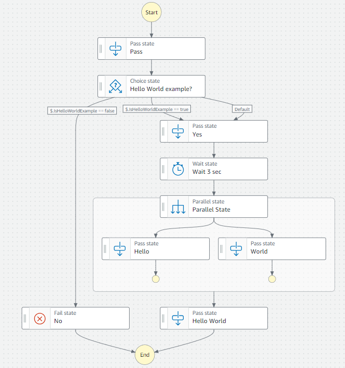

# AWS Step Functions

## Overview

AWS Step Functions is a serverless orchestration service that makes it easy to sequence AWS services and functions into scalable workflows. With Step Functions, you can design and execute serverless workflows that integrate services such as AWS Lambda, Amazon SNS, and Amazon DynamoDB and many more. Step Functions automatically manages the execution, error handling, and state of each step in your application workflow, allowing you **to focus on your business logic**.

## Table of Contents

- [Key Features](#key-features)
- [Use Cases](#use-cases)
- [How It Works](#how-it-works)
- [State Machines and Amazon States Language (ASL)](#state-machines-and-amazon-states-language-asl)
- [Centralized State Management](#centralized-state-management)
- [Pricing](#pricing)
- [Further Reading](#further-reading)

## Key Features

1. **Visual Workflow Management**: Use the visual editor, Workflow studio in the AWS Management Console to diagram and configure your state machines.
2. **Serverless Orchestration**: Automatically trigger and coordinate components of your serverless applications.
3. **Reliable Execution**: Step Functions ensures that each step in your workflow executes in order and as expected, with built-in error handling.
4. **Flexible Integrations**: Seamlessly integrate with various AWS services and resources.
5. **Scalable**: Automatically scale your workflows up or down according to demand, without needing to manage infrastructure.

## Use Cases

- **Data Processing**: Automate data transformation, aggregation, and analysis workflows.
- **Application Integration**: Orchestrate microservices, decouple application components, and manage inter-service communications.
- **IT Automation**: Automate operational tasks like backups, updates, and deployments.
- **Machine Learning Workflows**: Simplify the creation and management of machine learning model training and deployment pipelines.

## How It Works

AWS Step Functions orchestrates your workflows by connecting different AWS services and functions, allowing for the direct implementation of business logic within the workflow. This section details the process from design to execution, including the simplification of Lambda functions, and how Step Functions handle errors and retries.

###  1. Design Your Workflow

Start by creating a visual workflow (state machine) using the AWS Step Functions console. This state machine defines the sequence of tasks and decision logic your application will follow. You can directly implement significant portions of your business logic within the workflow by using Choice States to make decisions, Parallel States to execute tasks in parallel, and Input and Output Processing to manipulate JSON input and output.

### 2. Simplifying Lambda Functions

By embedding business logic in your state machine definitions, you can simplify the code in your AWS Lambda functions. Lambda functions can then focus on specific tasks without managing the control flow or error handling, which are handled by Step Functions. This approach leads to cleaner, more maintainable code and reduces the overhead of deploying and managing multiple Lambda functions.

### 3. Configuring Tasks

Define tasks within your workflow to perform work by integrating with AWS services. For example, you can set up tasks to invoke Lambda functions, publish messages to Amazon SNS topics, or put messages in Amazon SQS queues. Step Functions allow you to pass data between tasks, enabling a seamless flow of information through your workflow.

### 4. Error Handling and Retries

Step Functions provide robust mechanisms for error handling and retries, ensuring your workflows are resilient and reliable. You can define error handlers at the task level to catch specific errors and take corrective actions, such as retrying the task, moving to the next step, or failing the execution with a meaningful error message.

#### Retry Mechanism

You can configure retries for tasks that may fail transiently, specifying parameters such as:

- **MaxAttempts**: The number of retry attempts.
- **IntervalSeconds**: The time between retries.
- **BackoffRate**: The rate at which the retry interval increases.

This feature is crucial for handling errors gracefully and ensuring that temporary issues do not cause your entire workflow to fail.

### 5. Execution

Launch your workflow execution through the AWS Management Console, AWS CLI, or SDKs. Step Functions will manage the execution, state transitions, and error handling according to your state machine definition. You can monitor the execution in real-time, providing visibility into the workflow's progress and any issues that arise.

### 6. Monitor and Debug

Use the AWS Management Console to monitor the execution of your workflows. The console provides detailed execution history and logs, enabling you to trace the path of your workflow, understand decisions made during execution, and debug any issues. This visibility is key to maintaining and optimizing your workflows.

By leveraging AWS Step Functions for orchestrating your workflows, you gain the ability to implement complex business logic directly within your workflows, simplify your Lambda functions, and ensure your applications are robust through sophisticated error handling and retry mechanisms.

## State Machines and Amazon States Language (ASL)

State Machines in AWS Step Functions are defined using the Amazon States Language (ASL), a JSON-based, structured language designed for specifying the states and transitions of a workflow. ASL allows for the clear definition of the sequence of tasks, decision logic, parallel processing, and error handling within a workflow. As you will work with Infrastructure as code, you will define your state machines in ASL in your code.

Visual view of the state machine:

## Centralized State Management

AWS Step Functions manages the state of your workflows centrally, which brings several advantages and potential drawbacks, particularly in microservices architectures. AWS Step Functions, with its centralized workflow orchestration, stands **in contrast to event-driven architectures** that prioritize decentralized communication and processing through events. 

### Advantages:

- **Simplified State Management**: Centralizing state management reduces the complexity of tracking the state across multiple services.
- **Improved Visibility**: Provides a unified view of your workflow executions, making it easier to monitor and debug.
- **Consistency**: Ensures that the workflow execution state is consistent and reliably managed, even in the case of failures or retries.

### Potential Drawbacks:

- **Tight Coupling**: In a microservices architecture, having a centralized state can lead to tighter coupling between services, which might contradict the microservices principle of decentralized governance.
- **Single Point of Failure**: Centralized management can become a single point of failure if not properly designed for high availability and fault tolerance.
- **Scalability Concerns**: For very large and complex systems, centrally managing state might introduce bottlenecks or scalability limits, though AWS Step Functions is designed to scale automatically.

## Pricing

AWS Step Functions charges based on the number of state transitions that occur within your workflows. This pay-as-you-go pricing ensures you only pay for the actual use of Step Functions, without any upfront costs.

For detailed pricing information, visit the official [AWS Step Functions Pricing page](https://aws.amazon.com/step-functions/pricing/).

## Further Reading

- [Official AWS Step Functions Documentation](https://docs.aws.amazon.com/step-functions/index.html)
- [Getting Started with AWS Step Functions](https://aws.amazon.com/step-functions/getting-started/)
