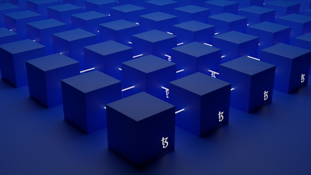
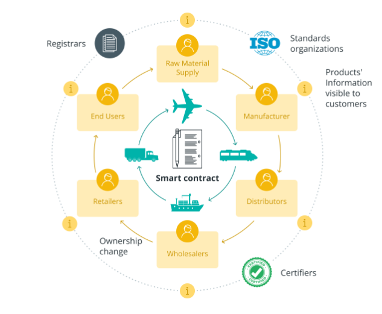

# Blockchain: Transforming the Future

## Overview
Blockchain technology is revolutionizing various industries, promising transparency, security, and decentralization. At its core, a blockchain is a distributed ledger that records transactions across a network of computers. These transactions are bundled into blocks, cryptographically linked, and stored in a chronological chain. This immutable and transparent nature of blockchain ensures trust among participants without the need for intermediaries.

## Table of Contents
- [Introduction to Blockchain](#introduction-to-blockchain)
- [Understanding Web3](#understanding-web3)
- [Use Cases](#use-cases)
  - [Supply Chain Management](#supply-chain-management)
  - [Finance and Banking](#finance-and-banking)
  - [Healthcare](#healthcare)
  - [Identity Management](#identity-management)
- [Smart Contracts](#smart-contracts)
- [Solidity](#solidity)  
- [References](#references)

## Introduction to Blockchain
Blockchain technology gained prominence with the advent of Bitcoin, the first decentralized cryptocurrency. However, its applications extend far beyond digital currencies. Blockchain enables peer-to-peer transactions, eliminates the need for intermediaries, and ensures data integrity through consensus mechanisms like Proof of Work (PoW) or Proof of Stake (PoS).

## Understanding Web3
Web3 represents the next generation of the internet, built on decentralized protocols and blockchain technology. Unlike Web2, which relies on centralized servers and platforms, Web3 empowers users with control over their data, identities, and transactions. It facilitates peer-to-peer interactions, fosters trust, and enables new decentralized applications (DApps) across various sectors.

## Use Cases
Blockchain technology has diverse applications across industries, transforming traditional processes and unlocking new possibilities.

### Supply Chain Management
Blockchain enhances supply chain transparency and traceability by recording every step of the product journey, from raw material sourcing to final delivery. This ensures authenticity, reduces fraud, and improves efficiency in logistics and inventory management.

### Finance and Banking
Blockchain disrupts traditional finance by enabling secure and instant cross-border transactions, reducing costs, and eliminating intermediaries. It also facilitates tokenization of assets, creating new investment opportunities and enhancing liquidity.

### Healthcare
Blockchain secures health records, ensures patient privacy, and streamlines data sharing among healthcare providers. It enables interoperability, accelerates medical research through secure data access, and enhances drug traceability to combat counterfeit medications.

### Identity Management
Blockchain-based identity solutions offer self-sovereign identity, allowing users to control and share their digital identities securely. It mitigates identity theft, simplifies KYC (Know Your Customer) processes, and enables access to services without centralized authorities.

### Smart Contracts
Smart contracts are self-executing agreements written in code, stored on a blockchain, and automatically enforce predefined rules. They enable trustless transactions, automate processes, and unlock decentralized applications in areas like insurance, real estate, and governance.

Blockchain technology, coupled with Web3 principles, continues to drive innovation, reshaping industries, and empowering individuals in the digital age.

### Solidity

Solidity is a high-level programming language used for writing smart contracts on blockchain platforms like Ethereum. It enables developers to define the rules and behaviors of smart contracts, including data storage, functions, and logic. Solidity syntax is similar to JavaScript, making it accessible for developers familiar with C-like languages.

Blockchain technology, coupled with Web3 principles, continues to drive innovation, reshaping industries, and empowering individuals in the digital age.

## References

- [Blockchain Overview](https://docs.aws.amazon.com/fr_fr/whitepapers/latest/aws-overview/blockchain.html)
