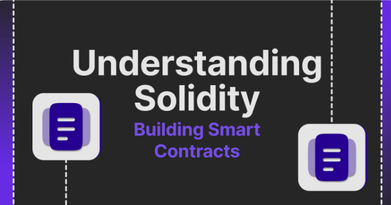

## Table of Contents
- [Introduction to Solidity](#introduction-to-solidity)
- [Understanding Solidity](#understanding-solidity)
- [Features of Solidity](#features-of-solidity)
- [Solidity Development Environment](#solidity-development-environment)
- [Getting Started with Solidity](#getting-started-with-solidity)
- [Conclusion](#conclution)
- [References](#references)

# Introduction to Solidity

Solidity is a high-level programming language used for writing smart contracts on the Ethereum blockchain. It is statically typed and supports inheritance, libraries, and complex user-defined types.

## Understanding Solidity

Solidity syntax is similar to JavaScript and is designed to be easy to learn for developers familiar with C-like languages. It enables developers to define the rules and behaviors of smart contracts, including data storage, functions, and logic.

## Features of Solidity

Solidity offers features such as:

- **Smart Contract Deployment**: Solidity code is compiled into bytecode and deployed to the Ethereum blockchain.
- **Security**: Solidity includes security features to prevent vulnerabilities such as reentrancy and integer overflow.
- **Interoperability**: Solidity contracts can interact with other contracts and external systems through function calls and events.

## Solidity Development Environment

Developers can write, compile, and deploy Solidity smart contracts using various tools and platforms, including Remix IDE, Truffle, and Hardhat. These environments provide features for testing, debugging, and deploying contracts to Ethereum networks.

## Getting Started with Solidity

To start developing with Solidity, beginners can explore online tutorials, official documentation, and community forums. Understanding basic blockchain concepts and Ethereum's architecture is essential for mastering Solidity development.

## Conclusion

Solidity empowers developers to create decentralized applications (DApps) and smart contracts that automate processes, enable decentralized finance (DeFi), and revolutionize various industries. As blockchain technology continues to evolve, proficiency in Solidity will be invaluable for building the decentralized future.

## References

- [Solidity Language Overview](https://docs.soliditylang.org/en/v0.8.24/)
